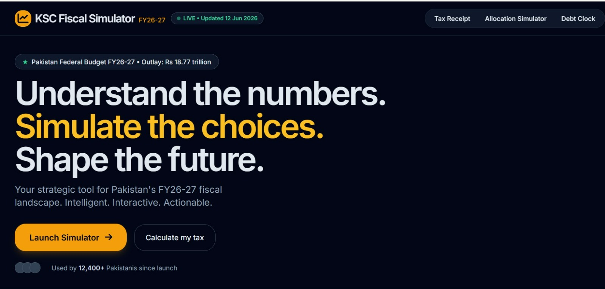

# 🇵🇰 Pakistan Federal Budget FY26-27 Simulator & Tax Calculator

**[🟢 View Live App: www.jus-smart.digital](https://www.jus-smart.digital/)**

## 📊 About the Project
Understand the numbers. Simulate the choices. Shape the future. 

The **KSC Fiscal Simulator** is an interactive, real-time fiscal intelligence engine and income tax calculator designed for Pakistan's FY26-27 Federal Budget. It empowers citizens, researchers, and policymakers to calculate their personal tax profiles and simulate national resource reallocation.

Created by **KSC.JUSNREM** (Khurram Chughtae).

## ✨ Features
* **Income Tax Calculator:** Instantly calculate tax liabilities based on the FY26-27 brackets.
* **Interactive Budget Simulator:** Reallocate federal funds across different sectors (Education, Defense, Healthcare, etc.) and see the real-time economic impact.
* **Data Visualization:** Clean, responsive charts for quick fiscal insights.
* **Export Reports:** Download your custom fiscal proposals and tax reports to PDF with one click.
* **Fully Responsive:** Beautifully designed for desktop, tablet, and mobile devices.

## 🛠️ Built With
* Standard HTML5 & JavaScript
* Tailwind CSS
* Chart.js
* html2canvas & jsPDF

## 🚀 How to Use
Simply visit the live link at **[jus-smart.digital](https://www.jus-smart.digital/)** to start simulating! No installation required.
